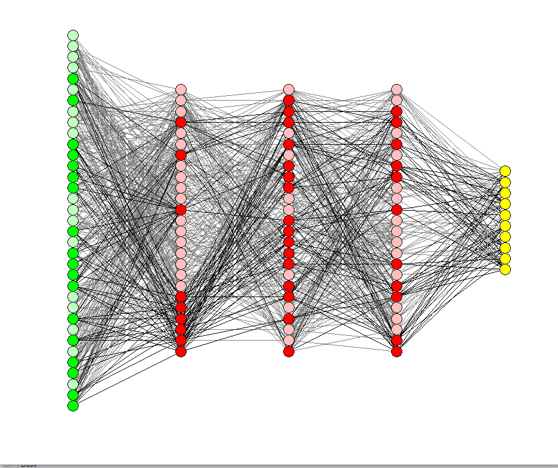

This repository contains an implementation of a Multi-Layer Perceptron (MLP) neural network using Python, specifically designed for educational purposes and experimentation. The MLP is implemented in the `MLP` class within the `mlp.py` file.

## Overview

A Multi-Layer Perceptron (MLP) is a type of feedforward artificial neural network. It consists of multiple layers of nodes, including an input layer, one or more hidden layers, and an output layer. Each node in a layer is connected to every node in the subsequent layer, and each connection has an associated weight.

The primary goal of an MLP is to approximate complex functions by learning the relationships between input data and output labels. Through a process called training, the MLP adjusts its weights and biases based on observed input-output pairs, enabling it to make accurate predictions on unseen data.

<div align="center">
    
</div>

## Architecture

The architecture of the MLP is customizable, allowing users to define the number of nodes in each layer and the number of hidden layers. This flexibility enables the network to adapt to different types of data and tasks.

## Activation Functions

Activation functions play a crucial role in determining the output of each node in the network. The MLP supports two types of activation functions:

- **Rectified Linear Unit (ReLU)**: Used in the hidden layers, ReLU introduces non-linearity into the network by outputting the input value if it is positive, and zero otherwise.
- **Sigmoid**: Employed in the output layer, the Sigmoid function squashes the network's output to a range between 0 and 1, making it suitable for binary classification tasks.

## Training Algorithm

The training of an MLP involves two primary steps: forward propagation and backward propagation (backpropagation).

- **Forward Propagation**: During forward propagation, input data is fed into the network, and the activations of each layer are computed sequentially. This process involves multiplying the input data by the weights of each layer, adding biases, and applying the activation function.

- **Backward Propagation (Backpropagation)**: In backpropagation, the error between the predicted output and the actual output is calculated using a chosen loss function (commonly mean squared error). The gradients of this error with respect to the weights and biases of the network are then computed recursively, starting from the output layer and moving backward through the network. These gradients are used to update the weights and biases via gradient descent, minimizing the error and improving the network's performance.

## Usage

To use the MLP implementation, follow these steps:

1. Import the `MLP` class from `mlp.py`.
2. Create an instance of the `MLP` class, specifying the desired architecture and learning rate.
3. Train the MLP using the `Train` method, providing training data and corresponding labels.
4. Optionally, test the trained MLP using the `Test` method with new data.

## Example

```python
from mlp import MLP
import numpy as np

# Define training data (XOR function)
train_data = np.array([[0, 0, 0], [1, 0, 1], [0, 1, 0], [1, 1, 0]])

# Create an MLP instance with specified architecture and learning rate
mlp = MLP(NInput=2, NHidden=4, NLHidden=1, NOutput=1, alpha=0.02)

# Train the MLP on the training data
mlp.Train(train_data[:, [0, 1]], train_data[:, 2], iterations=1000)

# Optionally, test the MLP on new data
test_data = np.array([[0, 0, 0], [1, 1, 1]])
mlp.Test(test_data[:, [0, 1]], test_data[:, 2], out=True)
```

## Requirements

- Python 3.x
- NumPy
- matplotlib (for visualization, optional)
- pandas (for data manipulation, optional)
- mpmath (for precise sigmoid function calculation)

## Contributors

This implementation was created by Hassan Ardeshir.
